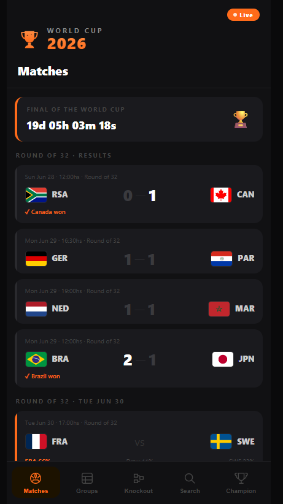
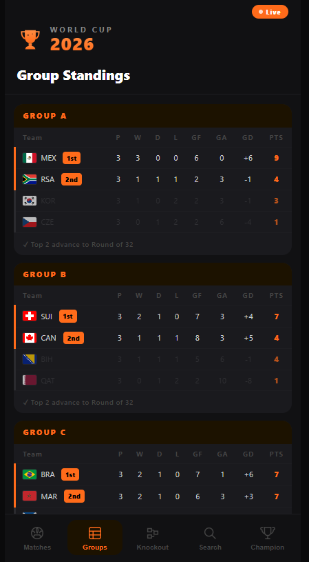
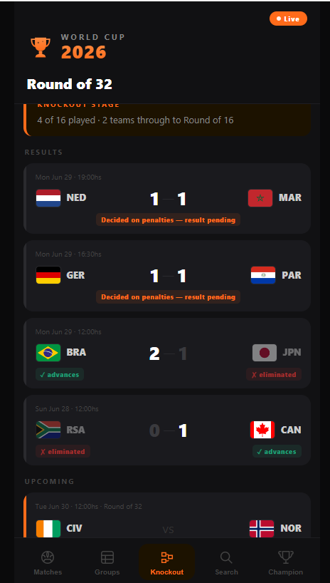
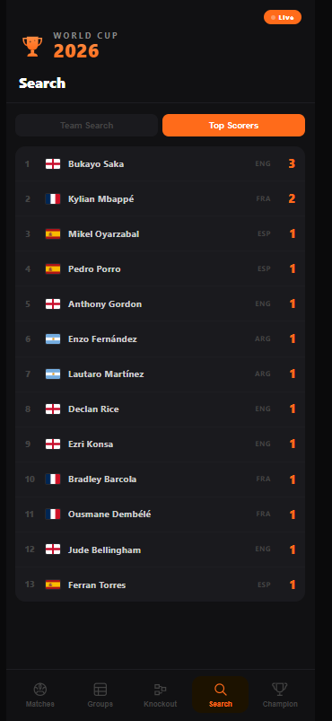

# ⚽ World Cup 2026 App

> A mobile-first World Cup 2026 tracker built from scratch with vanilla HTML, CSS & JavaScript — no frameworks, no libraries, just fundamentals. Tracks the entire real tournament, from Group Stage to Final.

🔴 **[Live Demo → devcodemate.github.io/world-cup-2026](https://devcodemate.github.io/world-cup-2026)**


---

## 📱 Screenshots

<div align="center">

| Matches | Groups | Knockout |
|---------|--------|----------|
|  |  |  |

| Search | Top Scorers | Champion |
|--------|-------------|----------|
|  |  |  |

</div>

---

## 🧠 Why I built this

I'm Flo — a self-taught junior frontend developer building my first portfolio from scratch.

This project started as a real question: *can I build something people actually want to use, while the event it's about is literally happening?*

The 2026 World Cup ran from June 11 to July 19. I built my own live tracker — not from a tutorial, not copying a template, but designing it from a wireframe, coding it piece by piece, and connecting it to real tournament data over the course of building it, match by match, all the way to Spain lifting the trophy. This README documents that whole process, mistakes included, because I think the mistakes are the most useful part for anyone reading this.

---

## ✨ Features

- **📅 Full match schedule** — all 104 matches of the real tournament: Group Stage, Round of 32, Round of 16, Quarter-finals, Semi-finals, third place and Final
- **🔴 Real, verified results** — every score, cross-checked across multiple independent sources, including penalty-shootout outcomes
- **📊 Group standings** — all 12 groups (A–L) with W/D/L, GF, GA, GD and points — calculated automatically from match results
- **🥊 Full knockout bracket** — every eliminatory round, with clear ✓ advances / ✗ eliminated indicators and penalty-shootout scores where the match went that far
- **⚽ Goal-by-goal detail** — tap any match to see who scored, in which minute, grouped by team (in progress for every match — currently complete for the final, expanding to the rest)
- **⚡ Top Scorers ranking** — calculated live from every goal recorded, no separate API needed
- **📈 Win probability bars** — a formula I designed myself, based on each team's group-stage points and goal difference, not a paid prediction API
- **🔍 Team search** — search any country, see full career stats, group position, and every result they played, group stage through Final
- **🏆 Champion screen** — reveals Spain as 2026 World Champions, illustrated custom artwork and flag
- **🌍 Flag tooltips** — tap any flag to see the full country name
- **📱 Mobile-first** — designed for phone, works on desktop too

---

## 🛠️ Tech stack

| What | How |
|------|-----|
| Structure | Semantic HTML5 |
| Styling | CSS3 — custom properties, flexbox, animations |
| Logic | Vanilla JavaScript — `fetch`, DOM manipulation, template literals, array methods |
| Data | Real, verified 2026 World Cup results — cross-checked against multiple independent sources match by match |
| Automation | GitHub Actions — used throughout the live tournament to auto-update `data.json` every hour; disabled after the Final once the underlying public dataset stopped publishing real-time results (see below) |
| Icons | Inline SVG — hand-drawn, no icon library |
| Flags | [flagcdn.com](https://flagcdn.com) — free flag CDN |
| Deploy | GitHub Pages — auto-deploy on every push to `main` |

**Zero frontend dependencies. Zero frameworks. Zero build tools.**
Every line of code written and understood by me.

---

## 🤖 How the data pipeline actually worked — and what I had to change mid-tournament

```
openfootball/worldcup.json → GitHub Actions (every hour) → data.json → app.js renders it
```

A Node.js script (`scripts/fetch-data.cjs`) ran on a schedule via GitHub Actions, pulling the latest tournament JSON, reshaping it into the format my app understands, and committing the result as `data.json`. This worked well through the group stage and into the Round of 32.

**Then the source stalled.** Partway through the knockout rounds, `openfootball/worldcup.json` stopped publishing real results — the file kept returning unresolved placeholders (`"team1": "W101"`, meaning "winner of match 101") for every match past a certain point, while the tournament kept being played in real life. My hourly automation was technically running fine; it just had nothing new to fetch.

Rather than leave the app showing stale placeholder data through the most exciting part of the tournament, I rebuilt `data.json` by hand for the remaining rounds — cross-referencing match results, scores, and penalty-shootout outcomes across multiple independent sources until every one of the 104 matches checked out consistently (group-stage points reconciled against individual results, knockout brackets connected logically team-to-team round to round). Once the Final was played and confirmed, I disabled the hourly cron entirely — automating against a dead source was pointless, and a static, verified `data.json` is more trustworthy than an automation that silently does nothing.

---

## 🪲 What actually went wrong (and what I learned)

Building this wasn't a straight line, and I think that's worth being upfront about:

- **Wrong data source first.** I integrated API-Football before realizing its free tier only covers older seasons (2022–2024), not 2026. Lesson: check a paid API's coverage *before* writing the integration, not after.
- **A silent JavaScript syntax error.** Leftover code at the bottom of a script (`await` outside an `async` function) silently broke the entire automation for a while — `data.json` kept regenerating empty with no clear error. Adding diagnostic logging to print the API's actual error response was what finally surfaced the real problem.
- **Node's module system bit me.** `fetch-data.js` failed in GitHub's runner with `ERR_AMBIGUOUS_MODULE_SYNTAX`. Renaming it to `.cjs` told Node explicitly "this is CommonJS" and fixed it for good — small detail, real lesson about how Node resolves module types.
- **My "free, updates automatically" data source quietly stopped being live.** The biggest lesson of the whole project: a working pipeline pointed at a source that silently stalls is worse than no pipeline at all, because it *looks* fine (green checkmarks, successful runs) while actually doing nothing useful. I only caught it by comparing what the app showed against what I knew was happening in the real tournament. Now I always spot-check automated data against an independent source before trusting a green build.
- **Git merge conflicts, more than once — including real ones, not just divergent history.** The hourly automation and my own commits both touched `data.json` at the same time repeatedly, including at least one case where Git couldn't auto-merge and I had to resolve it explicitly with `git checkout --ours` before committing. Real pressure, real fix, not a tutorial scenario.
- **A missing `permissions: contents: write` block silently broke automated commits.** GitHub's default `GITHUB_TOKEN` permissions are read-only unless a workflow explicitly requests write access. My Action was "succeeding" in a few seconds while quietly failing to push anything — a good reminder that a fast, green CI run isn't automatically a *correct* one.
- **A name mismatch almost broke team flags.** "Curaçao" (with the cedilla) didn't match my "Curacao" entry, and "Bosnia & Herzegovina" didn't match my abbreviated "Bosnia & Herz." — both silently failed to map to a flag until I wrote a script to diff the real team names against my dictionary.
- **I overbuilt the bracket UI first try.** My first version of the Knockout stage was a horizontal scrolling bracket like FIFA's official site. It looked fine on a wide screen and unreadable on an actual phone. I scrapped it and went back to a clear, vertical, mobile-first list instead — a good reminder that "looks impressive in a screenshot" and "actually usable on the device people will use" aren't the same thing.

---

## 📐 How I built it — the process

### 1. Design before code
Wireframes first — layout, color palette (black + `#FF6B1A` orange), navigation pattern, mobile viewport, before writing a single line of HTML.

### 2. Mobile-first CSS
CSS written starting from the smallest screen. Desktop styles added with `@media (min-width)`. Custom properties, `position: sticky/fixed`, flexbox, `@keyframes` animations.

### 3. JavaScript — data, render, navigate
```
app.js
├── DATA LOADING → fetch('data.json'), normalize into app format
├── RENDER       → functions that build HTML from data
└── NAVIGATE     → tab switching, countdown, modal, sub-tabs
```

### 4. Real, verified data — hourly automation, then hand-verified once the source stalled
- Found and integrated [openfootball/worldcup.json](https://github.com/openfootball/worldcup.json), a public-domain dataset, no API key required
- Wrote `scripts/fetch-data.cjs` to reshape that data into my app's format, including resolving team name mismatches and computing knockout-stage references
- Set up a GitHub Actions workflow (`.github/workflows/update-data.yml`) that ran the script every hour and auto-committed the result
- When the source stopped publishing real knockout-stage results mid-tournament, rebuilt the remaining rounds by hand from cross-referenced, verified sources, then disabled the cron once the Final was locked in

### 5. Git workflow
Used Git from commit one, with real branching and recovery from real mistakes along the way:

```
feat: initial commit — world cup 2026 app
feat: add match cards with probability bars
feat: add group standings table (12 groups)
feat: add team search with live stats
feat: add match detail modal with goals and stats
feat: add knockout stage panel and real verified match data
feat: add GitHub Actions workflow to auto-update data from API-Football
fix: correct workflows folder name
feat: replace API-Football with openfootball public dataset
fix: rename fetch-data.js to fetch-data.cjs to resolve Node module error
feat: connect app.js with data.json
feat: add logo-style header branding and regenerate data.json
feat: improve knockout results, group goals by team, and add win probability
feat: add top scorers sub-tab to search panel
fix: add write permissions to data update workflow
feat: rebuild with real complete 2026 World Cup results (104 matches)
feat: crown Spain 2026 world champion
chore: disable hourly cron, tournament finished
```

Worked with:
- **Conventional Commits** — `feat:`, `fix:`, `chore:`, `merge:`
- **Feature branches** — never committing directly to `main`
- **GitHub Pages** — auto-deploy on every push

---

## 📁 Project structure

```
world-cup-2026/
├── .github/
│   └── workflows/
│       └── update-data.yml   ← GitHub Actions: was auto-updating every hour, now disabled (tournament finished)
├── scripts/
│   └── fetch-data.cjs        ← Node.js script: pulls and reshapes real tournament data
├── images/                   ← App screenshots
├── index.html                ← App structure, semantic HTML, SVG icons
├── style.css                 ← Design tokens, layout, components, animations
├── app.js                    ← Data fetching, render functions, navigation logic
├── data.json                 ← Full, hand-verified 2026 World Cup results (104 matches)
└── README.md                 ← You are here
```

---

## 🎨 Design system

```css
--bg:      #0a0a0b   /* near-black background */
--surface: #111113   /* app shell */
--card:    #1a1a1e   /* match cards */
--orange:  #FF6B1A   /* primary accent */
--orange2: #FF8C42   /* gradient highlight */
--text:    #ffffff
--muted:   #444444   /* secondary labels */
```

---

## 🚀 Run it locally

```bash
# Clone the repo
git clone https://github.com/devCODEMATE/world-cup-2026.git

cd world-cup-2026

# Open with Live Server in VS Code
# Right click index.html → Open with Live Server

# To refresh the data locally (source is stale post-tournament, kept for reference):
node scripts/fetch-data.cjs
```

No `npm install`. No build step. No config. Just open and run.

---

## 📚 What I learned

**HTML** — Semantic elements, `data-*` attributes, inline SVG

**CSS** — Custom properties, mobile-first media queries, `position: sticky/fixed`, flexbox, `@keyframes` animations, pseudo-elements, `background-clip: text` for gradient typography

**JavaScript** — `fetch` and async data loading, DOM manipulation, event listeners, template literals, array methods (`filter`, `map`, `reduce`, `find`, `sort`), `setInterval`, date calculations, dynamic HTML rendering, modal patterns, designing my own scoring/probability algorithm

**Git & GitHub** — `init`, `add`, `commit`, `push`, `pull`, remote repositories, feature branches, Conventional Commits, `commit --amend`, resolving real merge conflicts (including hard conflicts with `checkout --ours`), GitHub Pages deployment, GitHub Actions, GitHub Actions permissions (`GITHUB_TOKEN` scopes), GitHub Secrets

**Data & APIs** — Evaluating whether a data source actually fits your use case before integrating it, working with public-domain datasets, designing data transformation pipelines, handling missing/incomplete data gracefully instead of faking it, **and recognizing when a "working" automated pipeline has quietly stopped being trustworthy**

**Node.js** — CommonJS vs ES Modules, debugging silent failures with diagnostic logging, scheduled automation via GitHub Actions cron

**Product thinking** — Knowing when a feature (a real-time API, a fancy horizontal bracket, an hourly cron against a dead source) isn't worth the complexity it adds, and choosing the simpler, more honest, more usable version instead

---

## 🔮 What's next

- [ ] Complete goal-by-goal detail (minute + scorer) for every match, not just the Final
- [ ] Add a lightweight confetti/animation moment on the Champion screen
- [ ] Revisit the Group Stage data model to support future tournaments beyond 2026
- [ ] Possibly contribute fixes upstream to openfootball if I spot more data mismatches

---

## 👋 About me

I'm **Flo** — a junior frontend developer based in Argentina, building my portfolio one real project at a time.

I'm not coming from a bootcamp or a CS degree. I'm coming from genuine curiosity, a lot of hours in VS Code, and a commitment to understanding *why* things work, not just *that* they work — including when they break.

Parts of this project were built with the guidance of **AI tools** — specifically Claude by Anthropic — to learn professional patterns around data pipelines, GitHub Actions, debugging, and dev workflows. Every decision, every mistake, and every fix was understood and implemented by me, in real time, while the actual 2026 World Cup was being played — right through the moment the data source went stale and I had to rebuild the results by hand to get it right.

I'm looking for my first paid role — junior frontend, internship, or freelance work where I can keep learning while contributing real value.

**Find me:**
- 🐙 GitHub: [@devCODEMATE](https://github.com/devCODEMATE)

---

<p align="center">
  Built with 🧡 and a lot of <code>git commit</code>s by <strong>devCODEMATE</strong> — during the actual 2026 World Cup, from kickoff to Spain lifting the trophy
</p>
