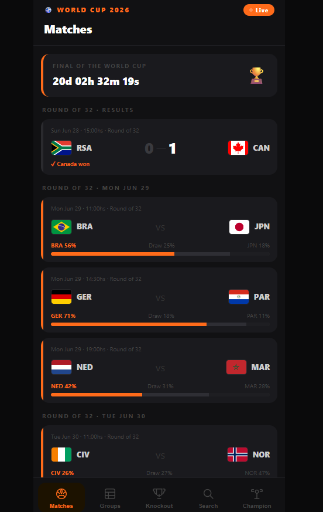
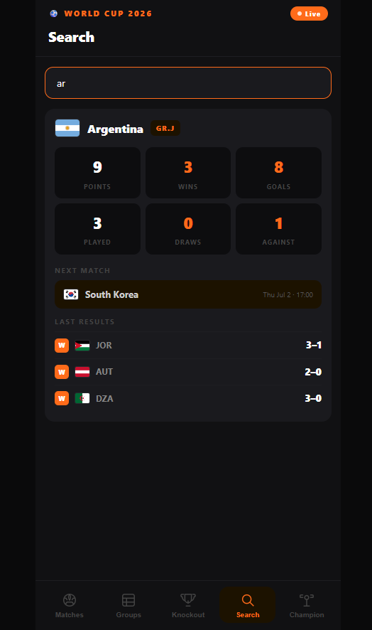
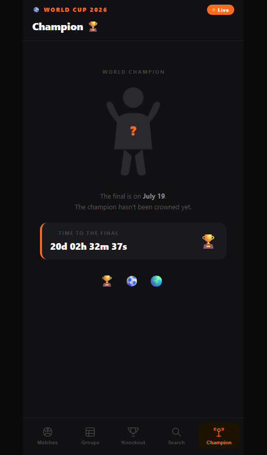

# ⚽ World Cup 2026 App

> A mobile-first World Cup 2026 tracker built from scratch with vanilla HTML, CSS & JavaScript — no frameworks, no libraries, just fundamentals.

🔴 **[Live Demo → devcodemate.github.io/world-cup-2026](https://devcodemate.github.io/world-cup-2026)**


---

## 📱 Screenshots

<div align="center">

| Matches | Groups | Search | Champion |
|---------|--------|--------|----------|
|  |  |  |  |

</div>

---

## 🧠 Why I built this

I'm Flo — a self-taught junior frontend developer building my first portfolio from scratch.

This project started as a real question: *can I build something people actually want to use?*

The 2026 World Cup is happening right now. Millions of people are checking scores, tracking their team, following the road to the final. I decided to build my own tracker — not with a tutorial, not copying a template, but designing it from a wireframe and coding it piece by piece.

This is the result: a real app, deployed, working, built by a junior dev who's learning every single day.

---

## ✨ Features

- **📅 Match schedule** — every game from group stage to Round of 32, with dates and local times
- **🔴 Live results** — scores and results for all completed matches
- **📊 Group standings** — all 12 groups (A–L) with W/D/L, GF, GA, GD and points — calculated automatically from match data
- **🏆 Knockout stage** — Round of 32 bracket with upcoming matches and win probabilities
- **🔍 Team search** — search any country, see their stats: points, wins, goals, recent results and next match
- **📈 Win probability bars** — percentage chances for upcoming matches
- **⚽ Match detail modal** — tap any match to see goals with scorer names and minutes
- **⏱️ Countdown** — live timer counting down to the Final on July 19
- **🏆 Champion screen** — animated figure with the winner's flag once the tournament ends
- **🌍 Flag tooltips** — tap any flag to see the full country name
- **📱 Mobile-first** — designed for phone, works on desktop too

---

## 🛠️ Tech stack

| What | How |
|------|-----|
| Structure | Semantic HTML5 |
| Styling | CSS3 — custom properties, flexbox, animations |
| Logic | Vanilla JavaScript — DOM manipulation, template literals, array methods |
| Data | Real match data — manually curated from FIFA official sources |
| API Integration | API-Football (api-sports.io) via GitHub Actions — auto-updates data.json every hour |
| Icons | Inline SVG — hand-drawn, no icon library |
| Flags | [flagcdn.com](https://flagcdn.com) — free flag CDN |
| Deploy | GitHub Pages — auto-deploy on every push to `main` |

**Zero frontend dependencies. Zero frameworks. Zero build tools.**
Every line of code written and understood by me.

---

## 🤖 API & Automation

This project integrates with the **API-Football** free tier to auto-update match data:

- Match results, standings and upcoming fixtures are fetched automatically via **GitHub Actions**
- A workflow runs every hour, calls the API with a secure key stored in GitHub Secrets, and commits an updated `data.json` to the repo
- The API key is **never exposed in the code** — it lives in GitHub Secrets only
- Built with the guidance of **AI tools** (Claude by Anthropic) to understand API integration patterns, GitHub Actions workflow structure, and professional dev practices

```
API-Football → GitHub Actions (every hour) → data.json → App
```

---

## 📐 How I built it — the process

### 1. Design before code
I started with wireframes — sketching the layout, the color palette (black + `#FF6B1A` orange), the navigation pattern, and the mobile viewport before writing a single line of HTML.

**Design decisions I made intentionally:**
- Dark theme because sports apps live at night
- Orange accent — reads energy and urgency
- Bottom nav bar — where thumbs reach on mobile
- Sticky header so the user always knows where they are

### 2. Mobile-first CSS
CSS written starting from the smallest screen. Desktop styles added with `@media (min-width)`.

Key CSS concepts used:
- **CSS custom properties** — change one variable, update the whole app
- **`position: sticky`** — header stays visible while content scrolls
- **`position: fixed`** — bottom nav stays at the bottom on any screen
- **Flexbox** — match card layout and tab bar
- **CSS animations** (`@keyframes`) — live dot pulse, floating champion figure

### 3. JavaScript — data, render, navigate
The JS is structured in three clear responsibilities:

```
app.js
├── DATA        → teams, matches, standings (real tournament data)
├── RENDER      → functions that build HTML from data
└── NAVIGATE    → tab switching, countdown, tooltip, modal logic
```

Key things learned by building this:
- `querySelectorAll` + `forEach` to connect multiple buttons with `data-tab` attributes
- Template literals to build HTML strings dynamically
- `setInterval` for the live countdown
- `Array.filter`, `Array.reduce`, `Array.find` for calculating team stats on the fly
- Dynamic standings calculated automatically from match results — no hardcoding
- Modal pattern with CSS transitions for match detail view

### 4. API integration & GitHub Actions
- Registered for a free API-Football account
- Stored the API key securely in GitHub Secrets
- Built a Node.js script (`scripts/fetch-data.js`) that calls the API and generates `data.json`
- Created a GitHub Actions workflow (`.github/workflows/update-data.yml`) that runs the script every hour automatically

### 5. Git workflow
Used Git from commit one — not as an afterthought.

```
feat: initial commit — world cup 2026 app
feat: add match cards with probability bars
feat: add group standings table (12 groups)
feat: add team search with live stats
feat: add match detail modal with goals and stats
feat: add knockout stage panel and real verified match data
feat: add GitHub Actions workflow to auto-update data from API-Football
fix: correct workflows folder name
docs: add app screenshots
```

Worked with:
- **Conventional Commits** — `feat:`, `fix:`, `docs:`, `style:`
- **Feature branches** — never committing directly to `main`
- **GitHub Pages** — auto-deploy on every push

---

## 📁 Project structure

```
world-cup-2026/
├── .github/
│   └── workflows/
│       └── update-data.yml   ← GitHub Actions: auto-update every hour
├── scripts/
│   └── fetch-data.js         ← Node.js script: calls API, writes data.json
├── images/                   ← App screenshots
├── index.html                ← App structure, semantic HTML, SVG icons
├── style.css                 ← Design tokens, layout, components, animations
├── app.js                    ← Data, render functions, navigation logic
├── data.json                 ← Auto-generated by GitHub Actions
└── README.md                 ← You are here
```

---

## 🎨 Design system

```css
--bg:      #0a0a0b   /* near-black background */
--surface: #111113   /* app shell */
--card:    #1a1a1e   /* match cards */
--orange:  #FF6B1A   /* primary accent */
--orange2: #FF8C42   /* gradient highlight */
--text:    #ffffff
--muted:   #444444   /* secondary labels */
```

---

## 🚀 Run it locally

```bash
# Clone the repo
git clone https://github.com/devCODEMATE/world-cup-2026.git

cd world-cup-2026

# Open with Live Server in VS Code
# Right click index.html → Open with Live Server
```

No `npm install`. No build step. No config. Just open and run.

---

## 📚 What I learned

**HTML** — Semantic elements, `data-*` attributes, inline SVG

**CSS** — Custom properties, mobile-first media queries, `position: sticky/fixed`, flexbox, `@keyframes` animations, pseudo-elements

**JavaScript** — DOM manipulation, event listeners, template literals, array methods (`filter`, `map`, `reduce`, `find`), `setInterval`, date calculations, dynamic HTML rendering, modal patterns

**Git & GitHub** — `init`, `add`, `commit`, `push`, `pull`, remote repositories, feature branches, Conventional Commits, GitHub Pages deployment, GitHub Actions, GitHub Secrets

**APIs** — REST API concepts, HTTP headers, API keys, rate limits, free tier usage

**GitHub Actions** — YAML workflow syntax, scheduled jobs (`cron`), environment secrets, automated commits

---

## 🔮 What's next

- [ ] Connect `app.js` to read `data.json` for fully live data
- [ ] Update results as knockout stage progresses (Round of 16, QF, SF, Final)
- [ ] Animate champion screen when winner is confirmed
- [ ] Add full knockout bracket visualization
- [ ] Refactor data into separate `data.js` file

---

## 👋 About me

I'm **Flo** — a junior frontend developer based in Argentina, building my portfolio one real project at a time.

I'm not coming from a bootcamp or a CS degree. I'm coming from genuine curiosity, a lot of hours in VS Code, and a commitment to understanding *why* things work, not just *that* they work.

Parts of this project were built with the guidance of **AI tools** — specifically Claude by Anthropic — to learn professional patterns around API integration, GitHub Actions, and dev workflows. Every decision was understood and implemented by me.

This is my second deployed project. I'm looking for my first paid role — junior frontend, internship, or freelance work where I can keep learning while contributing real value.

**Find me:**
- 🐙 GitHub: [@devCODEMATE](https://github.com/devCODEMATE)

---

<p align="center">
  Built with 🧡 and a lot of <code>git commit</code>s by <strong>devCODEMATE</strong>
</p>